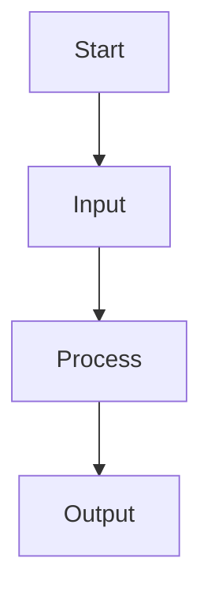
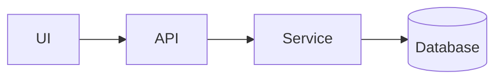
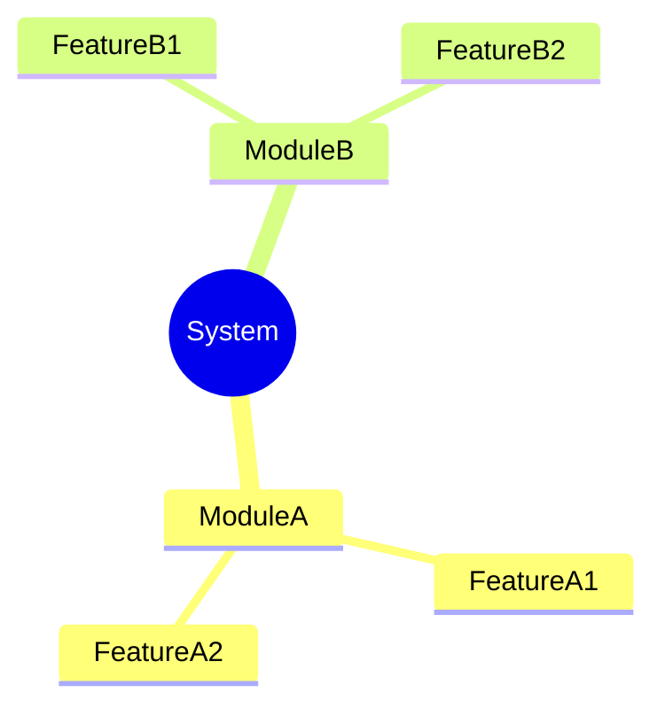

# CONTRIBUTING.md

**Authoring Standards - Concise, Clear, Structured Documentation**

---

## 1. Writing Principles

- Keep content **concise, clear, and direct**.
- Avoid verbosity, filler, and long explanations.
- Prioritize **structure, flow, and readability**.
- Use short paragraphs and precise language.

---

## 2. Document Structure

Every document should follow this sequence:

### A. Objective
State the purpose in 1–2 lines.

### B. Components
- Break content into logical parts.
- Use bullet lists or tables for clarity.

### C. Flow / Interaction
- Describe how components relate or interact.
- Use Mermaid diagrams when relationships matter.

### D. Summary
Provide a short recap or next steps.

---

## 3. Mermaid Flow Diagrams

Use for processes, interactions, or system flow.

**Example:**

**Guidelines:**
- Keep nodes short.
- Show only essential steps.

---

## 4. Mermaid Component Diagrams

Use for architecture, modules, or system relationships.

**Example:**

**Guidelines:**
- Focus on high-level structure.
- Avoid unnecessary detail.

---

## 5. Mermaid Mind Maps

Use for conceptual breakdowns or hierarchical ideas.

**Example:**

**Guidelines:**
- Keep branches minimal.
- Avoid deep nesting unless required.

---

## 6. Formatting Rules

- Use consistent Markdown headings (`##`, `###`).
- Prefer bullet lists over long paragraphs.
- Use tables for comparisons.
- Use code blocks only for code or diagrams.
- Avoid decorative or excessive formatting.

---

## 7. Tone & Style

- Professional, neutral, and direct.
- No unnecessary adjectives.
- No storytelling unless requested.
- Clarity over creativity.

---

## 8. Avoid

- Verbose explanations
- Redundant text
- Overuse of diagrams
- Long introductions or conclusions
- Unnecessary technical jargon

---

## 9. Code & Architecture

**When writing code:**
- Provide minimal, focused examples.
- Comment only where clarity improves.

**When writing architecture:**
- Provide component list + flow + diagram.
- Keep descriptions short and functional.

---

## 10. Final Checklist

  must ensure:

- [ ] Clear objective
- [ ] Concise components
- [ ] Logical flow
- [ ] Mermaid diagram if helpful
- [ ] Mind map if helpful
- [ ] No verbosity
- [ ] High clarity
